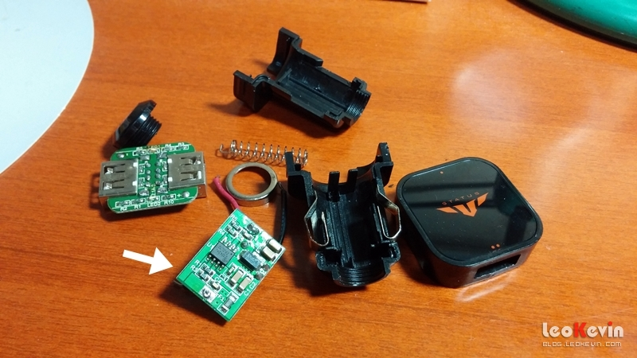
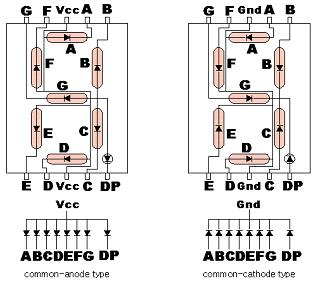
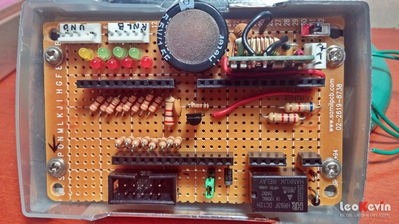

수동미션 기어 표시 장치
======================
# 개요
* 기어레버에 센서 역활을 하는 스위치를 장착하고 FND 표시장치로 현재의 기어단수를 표시.
* 센서가 읽어들인 상태를 atmel의 AVR을 이용해 처리.
* 센서의 제작은 실제 차량에 맞춰 크기와 간격 등을 조절.
* 회로제작 못지않게 센서의 정확한 제작 및 장착이 중요.
* 프로그램 소스의 상업적 사용 금지.

****
# 원작자
* 원작자 : Seung-Won Lee  http://whoisit.tistory.com  SoftWareYi@gmail.com

****
# 특징/기능
* 기어변경시 현재의 기어상태를 7-세그먼트 문자표시기(FND)를 통해 즉시 표시.
* 시동이 걸리지 않아도 표시 가능.
* 클럭소모를 최소화하고 Timer/Counter 를 이용하여 빠르고 정확한 타이밍.
* PWM 을 이용하여 부드러운 밝기 변화.
* 7-세그먼트 타입 지정 가능.
* 특정 기어조작을 통해 설정메뉴로 진입 & 일부 설정 즉시 변경 가능.
* 시스템 클럭에 맞춰 동작속도 자동조절
* 슈퍼캐패시터를 이용해서 시동모터 작동시 전원유지
* 제작기&자세한 설명 http://blog.leokevin.com/221184700523

****
# DIY Steps
## 1. 부품 구하기
* AVR (최소요구사양)
  * I/O
    * 입력 8개(포트 1개)
    * 출력 16개(포트 2개) + PWM 1개
    * 8-Bit Timer/Counter 2개
    * 외부인터럽트 2개
  * Memory
    * 30KB Program Flash memory
    * 4byte EEPROM
  * 개발에 사용한 AVR보드 : JMOD-128-1(ATmega128) http://jcnet.co.kr/?p=48
* 리드스위치
  * PMC-1001 http://www.eleparts.co.kr/EPX33BHN
* 네오디뮴 자석
  * 5파이 2T http://www.eleparts.co.kr/EPX34WVG
* 7-세그먼트
  * Common Anode, Cathode 타입을 프로그램에서 지정할 수 있음.
* 5볼트 레귤레이터 : LM7805 또는 차량용 충전기의 레귤레이터(컨버터) 부분이용
  * 
* 다이오드 : 1N4001~7, 1N4148, 1N5819(슈퍼캐패시터 사용시)
* 캐패시터 : 0.1~470uF
* 슈퍼캐패시터 : 5.5V 1F 내외 (옵션)
* LED
* 저항 : 330Ω, 10kΩ
* PNP Transistor : 2SA1085
  * PWM 기능의 스위칭을 위해 사용.
* 릴레이 : 12VDC
  * 미등 점등 여부 감지를 위해 사용.
  * 야간 밝기 조절 기능을 사용하지 않는다면 제거 가능.
* 커넥터, 점퍼

****
## 2. 회로구성
* Circuit : https://easyeda.com/LeoKevin/avr-gear-gauge



****
## 3. C 프로그래밍
## 3.1 SDI
* AVR Studio
  * Overview https://www.microchip.com/avr-support
  * Archive http://www.microchip.com/avr-support/avr-and-sam-downloads-archive
* AVR Toolchain (for AVR Studio 4) http://www.microchip.com/avr-support/avr-and-arm-toolchains-(c-compilers)

****
## 3.2 소스파일 다운로드
* 다운로드할 소스파일
  * GearGauge.c : main()
  * MySettings.h : 사용자셋팅 헤더
  * GearGaugeLib.h : 라이브러리 헤더
  * libGearGaugeLib-???.a : 라이브러리
* 저장할 폴더는 .c파일을 제외하고 아무곳이나 관계없지만, 편의를 위해 모두 메인 .c 파일과 같은 폴더에 저장
* libGearGaugeLib-???.a 파일은 기기에 맞는 것으로 다운로드후 libGearGaugeLib.a 으로 이름을 변경하세요.

****
## 3.3 소스 수정(MySettings.h)
### 1) 고정설정
소스 작성시 정해지는 설정. 컴파일 후에는 변경할 수 없음.

### * 시스템 클럭
```c
#define F_CPU		16000000UL
```
- 기본값 : 16MHz

### * 기어위치 센서용 포트
```c
#define DDR_SNR		DDRA
#define PORT_SNR	PORTA
#define PIN_SNR		PINA
```
- 기본값 : PORT A
- 입력핀 8개짜리 포트 지정

### * 센서입력상태 LED용 포트
```c
#define DDR_LED		DDRC
#define PORT_LED	PORTC
```
- 기본값 : PORT C
- 출력핀 8개짜리 포트 지정

### * 7-세그먼트용 포트
```c
#define DDR_SEG		DDRF
#define PORT_SEG	PORTF
```
- 기본값 : PORT F
- 출력핀 8개짜리 포트 지정

### * PWM 출력용 포트
```c
#define DDR_PWM		DDRB
#define PORT_PWM	PORTB
#define PIN_PWM		DDB7
```
- 기본값 : PORT B
- OC2 출력핀이 있는 포트와 핀을 설정

### * 외부인터럽트 포트
```c
#define DDR_INT		DDRD
#define PIN_INT0	PIND0
#define PIN_INT1	PIND1
```
- 기본값 : PORT D
- INT0 & INT1 입력핀이 있는 포트와 핀을 설정

### * 7-세그먼트 타입
```c
#define SEG_COM_ANODE	1
```
- 0 : Common Cathode 타입(공통-)
- 1 : Common Anode 타입(공통+)

### * 출력전원용 트랜지스터 사용여부
```c
#define SEG_USE_TR	1
```
- 0 : 사용안함(OC2 단자에서 FND 공통단자로 연결)
- 1 : 사용함(OC2 단자 - Tr - FND 공통단자로 연결)

### * 설정모드 진입모션
```c
#define PREF_MOTN	"5151"
```
- 기본값 : 5단 - 1단 - 5단 - 1단
- 조작할 단수를 원하는만큼 나열하여 작성
- 조작후 중립으로 해야 인식됨
- 설정모드 종료는 후진
- __시동을 끄고 안전한 곳에서 조작할것을 권장__

### * 센서 Map
```c
#define SENSOR_MAP	{\
	{ 0b00100010, 'N' }, \
	{ 0b00010100, '1' }, \
	{ 0b01000100, '2' }, \
	{ 0b00010010, '3' }, \
	{ 0b01000010, '4' }, \
	{ 0b00010001, '5' }, \
	{ 0b01000001, '6' }, \
	{ 0b00011000, 'B' }, \
	{ 0b00100100, 'L' }, \
	{ 0b00101000, 'L' }, \
	{ 0b00100001, 'R' }, \
}
```
- PORT_SNR 의 입력값 : 0b __76543210__
- 차량의 기어조작 형태에 따라 설정.
- 기본상태는 회로도의 기어형태 참고.
- 0b0 뒤에 [3bit:shift cable] [4bit:select cable]

### * 증가조작 기어
```c
#define SENSOR_UP	3
```
- 설정모드의 값 변경시 증가로 인식할 기어단수

### * 감소조작 기어
```c
#define SENSOR_DW	4
```
- 설정모드의 값 변경시 감소로 인식할 기어단수

### * 미사용 핀 상태
```c
#define UNUSED_STY	1
```
- 미사용 핀의 초기값 설정
- 0 : 입력(내부풀업 작동)
- 1 : 출력(출력값 없음)

### * USART 로그 출력
```c
#define USART_LOG	0
```
- USART 통신으로 동작로그 출력
- 0 : 사용안함
- 1 : 사용안함

### * 프로그램 시작 대기시간
```c
#define START_DELAY_MS	1000
```
- 마이크로초 단위 정수로 입력. (예: 1000 -> 1초)

### * 센서상태표시 LED 사용
```c
#define USE_LED		1
```
- 소비전력 절약 목적으로 LED 사용 선택
- 0 : 사용안함
- 1 : 사용안함

****

### 2) 변동설정
- 실행중에 설정모드에서 변경 가능한 설정.
- 변동설정의 값들은 EEPROM에 저장.
- 후진기어 입력하면 설정모드 종료.
- __시동을 끄고 안전한 곳에서 조작할것을 권장__

### * 웰컴 세레모니(C)
```c
#define My_Crmny    2
```
- 0 : 사용안함
- 1 : 전체점등 1초
- 2 : 애니메이션
- 설정모드에서 'C' 표시됨.

### * 변속조작시 효과(F)
```c
#define My_eFx    1
```
- 0 : 사용안함
- 1 : 이전 기어 서서히 사라짐 & 입력 기어 깜빡임
- 2 : 이전 기어 깜빡임
- 설정모드에서 'F' 표시됨.

### * 슬립모드 효과(S)
```c
#define My_Sleep    2
```
- 0 : 사용안함
- 1 : 회전효과
- 2 : 숨쉬기
- 3 : 화면끄기
- 설정모드에서 'S' 표시됨.

### * 후진 표시 옵션(r)
```c
#define My_rvs    0
```
- 0 : 글자가 깜빡임
- 1 : 점(DP)이 깜빡임
- 설정모드에서 'r' 표시됨.

### * 고조도 밝기정도(H)
```c
#define My_High    100
```
- 미등상태가 아닐때의 기본 밝기를 %값으로 설정.
- 5(어두움) ~ 100(밝음)까지 설정가능.(10단계)
- 설정모드에서 'H' 표시됨.

### * 저조도 밝기정도(L)
```c
#define My_Low    10
```
- 야간에 미등점등시 밝기를 %값으로 설정.
- 1(어두움) ~ 90(밝음)까지 설정가능.(8단계)
- 설정모드에서 'L' 표시됨.

### * 동작속도 조절 계수(t)
```c
#define My_Tempo	5
```
- 화면표시 속도를 조절
- 1 ~ 9까지 조절
- 1(느림) ~ 5(기본) ~ 9(빠름)
- 설정모드에서 't' 표시됨.

### * 동작전원(P)
- 값 변경시 재시작 전까지 동작중단됨.
- 설정모드에서 'P' 표시됨.

****
## 3.4 컴파일 & 업로드
* libGearGaugeLib.a 라이브러리 추가
* 위의 회로도와 동일하게 제작한 경우, 미리 컴파일 해놓은 [GearGauge-ATmega128.hex](./Release/GearGauge-ATmega128.hex) , [GearGauge-ATmega128-Log.hex](./Release/GearGauge-ATmega128-Log.hex) 파일 사용가능.

****
# 업데이트 기록
* v2.3
  * 숨쉬기 속도 조정

* v2.2
  * main() 간소화

* v2.1
  * 워치독타이머 적용
  * 프로그램 시작 대기 기능 추가
    * 초기전원 불안정에 대비하기 위함
  * 전원 차단 대응 로직 추가
    * 슈퍼캐패시터, 외부인터럽트0&1 사용
    * 전원 차단 3초후 프로그램 종료 & MCU 파워다운모드
    * 전원 재공급시 리셋
  * 상태표시 LED 사용여부 선택 추가

* v2.0
  * 라리브러리 형태로 제공
  * 동작속도 조절 기능 추가
  * 미사용 포트&핀 처리방식 선택 추가
  * 로그 출력기능(USART) 추가
  * 설정모드의 항목명과 현재값을 번갈아 표시
  * 셋팅모드의 후진옵션 노출순서 변경
  * 셋팅모드 증가/감소 인식 설정 추가
  * 사용자셋팅 검증 루틴 추가
  * 버그수정 및 코드정리

* v1.7
  * 밝기 조정 관련 옵션 표시 문자 변경 (b->H , d->L)
  * 버그수정

* v1.6
  * 후진표시 방식 옵션 추가
  * 셋팅 변경시 깜빡임 시간 단축
  * MySettings.h 중복 include 방지

* v1.5
  * 사용하지 않는 포트를 output with none 으로 설정 (JMOD-128 의 G0핀의 구동을 표시하는 LD2를 확실히 끄기 위해)
  * 동작중단 실행을 기어봉 up, down 모두에 적용시킴
  * 동작중단시 'byE' 시그널 표시
  * My_Sleep=3 의 구현 방식을 무출력에서 PWM조절로 변경
  * My_eFx=0 , My_Sleep=3 일때 기어봉을 좌우로만 움직여도 wake up 시킴
  * My_eFx=0 일때 기어봉 좌우 조작된 상태를 중립으로 표시
  * 버그수정

* v1.4
  * 사용하지 않는 포트를 input with pull-up 으로 설정

* v1.3
  * 변경효과 깜빡임 속도 변경
  * 웰컴세레모니 로직 변경

* v1.2
  * 사용하지 않는 포트를 output으로 설정
  * MCU 슬립모드 사용
  * 숨쉬기 속도 조정
  * 버그수정

* v1.1
  * 동작중단(AVR sleep) 기능 추가
  * 센서맵을 MySettings.h 로 이전
  * 버그수정

* v1.0
  * 초기버전 등록
